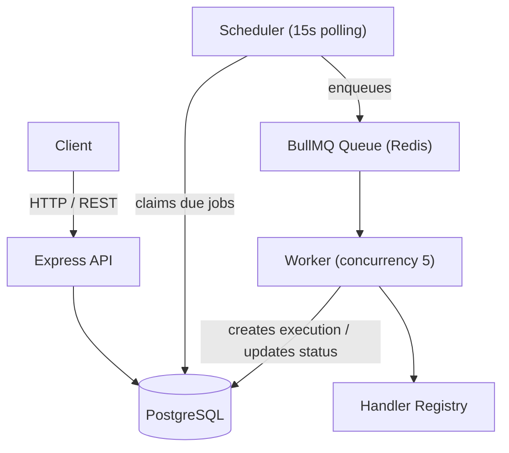
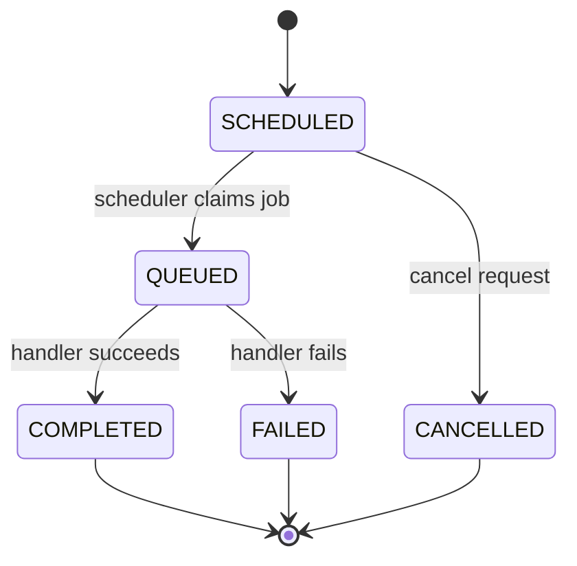
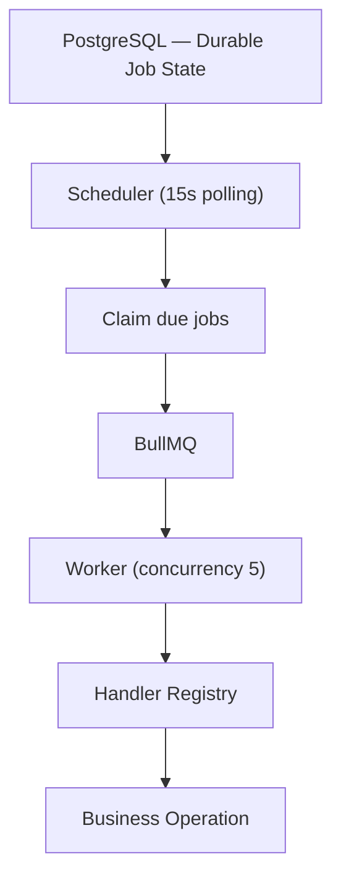

# Zolt

Zolt is a backend job scheduling and execution system. It accepts jobs through a REST API, schedules them durably in PostgreSQL, and hands them off to a Redis-backed queue for execution by a worker pool.

> **Status: V0.** Zolt V0 is a functional, end-to-end job scheduling and execution system running as a single scheduler instance. It is not yet distributed, fault-tolerant, or recoverable — those are explicitly V1+ concerns. See [What V0 Does Not Have Yet](#12-what-v0-does-not-have-yet) below.

## Table of Contents

1. [What is Zolt?](#1-what-is-zolt)
2. [Core Architecture](#2-core-architecture)
3. [Job Management](#3-job-management)
4. [Job Types & Lifecycle](#4-job-types--lifecycle)
5. [Database Schema](#5-database-schema)
6. [Scheduler](#6-scheduler)
7. [Queue & Worker (BullMQ / Redis)](#7-queue--worker-bullmq--redis)
8. [Execution Tracking](#8-execution-tracking)
9. [Handler Registry](#9-handler-registry)
10. [Error Handling & Validation](#10-error-handling--validation)
11. [Technologies](#11-technologies)
12. [What V0 Does Not Have Yet](#12-what-v0-does-not-have-yet)
13. [API Overview](#13-api-overview)
14. [Backend Engineering Decisions](#14-backend-engineering-decisions)
15. [V0 Mental Model](#15-v0-mental-model)
16. [Project Structure](#16-project-structure)
17. [Running Locally](#17-running-locally)
18. [Closing](#18-closing)

---

## 1. What is Zolt?

Zolt separates **job state** from **job execution**. A job is durably recorded in PostgreSQL the moment it's created; a polling scheduler later claims due jobs and hands them to a BullMQ queue, where a worker pool picks them up, runs the registered handler, and records the outcome as a separate execution record.

```
Client
  ↓
Express API
  ↓
PostgreSQL
  ↓
Scheduler
  ↓
BullMQ / Redis
  ↓
Worker
  ↓
Handler
```

PostgreSQL is the source of truth for job state at every stage — the queue is a hand-off mechanism, not where job state lives.

## 2. Core Architecture



The API writes and reads job state directly against PostgreSQL. The scheduler is the only component that moves a job from `SCHEDULED` into the queue; the worker is the only component that executes a job and records its outcome.

## 3. Job Management

Implemented via the REST API:

- Create a job
- Get a job by ID
- List jobs, with:
  - Pagination
  - Status filtering
  - Sorting, restricted to an allowlisted set of columns
- Cancel a scheduled job
- Request validation on every write, using **Zod**

## 4. Job Types & Lifecycle

### Supported job types

```
IMMEDIATE
ONCE
```

### Lifecycle



A job moves from `SCHEDULED` to `QUEUED` only when the scheduler claims it; a `SCHEDULED` job can be cancelled directly. Once a job is `QUEUED`, its outcome is `COMPLETED` or `FAILED`, determined by the worker.

## 5. Database Schema

PostgreSQL is accessed directly via `pg`, with schema changes managed through **node-pg-migrate**.

```
jobs
 ├── id
 ├── type              (IMMEDIATE | ONCE)
 ├── status             (SCHEDULED | QUEUED | COMPLETED | FAILED | CANCELLED)
 ├── run_at
 ├── payload
 ├── created_at
 └── updated_at

executions
 ├── id
 ├── job_id ─────────────► jobs.id
 ├── attempt
 ├── status
 ├── started_at
 ├── finished_at
 └── error
```

Built as part of the schema:

- Foreign key from `executions` → `jobs`
- Constraints on job status and schedule-type values
- A `(status, run_at)` index, specifically to support the scheduler's due-job query
- Migrations via `node-pg-migrate`

## 6. Scheduler

Zolt V0 uses a **single polling scheduler instance**. On each tick it:

1. Runs every **15 seconds**.
2. Queries for due jobs (`status = SCHEDULED AND run_at <= now()`), using the `(status, run_at)` index.
3. Processes them in **batches of 100**.
4. Claims each batch by transitioning `SCHEDULED → QUEUED`.
5. Enqueues the claimed jobs into BullMQ.

```
Every 15s
   │
   ▼
Find due jobs (status, run_at)
   │
   ▼
Batch of up to 100
   │
   ▼
Claim: SCHEDULED → QUEUED
   │
   ▼
Enqueue into BullMQ
```

This is a single-instance polling design — it does not yet coordinate multiple scheduler instances or use row-level locking to guard against concurrent claims (see [What V0 Does Not Have Yet](#12-what-v0-does-not-have-yet)).

## 7. Queue & Worker (BullMQ / Redis)

### Queue

- A single BullMQ `jobs` queue
- Redis as the backing store
- Bulk enqueueing when the scheduler claims a batch
- Exponential backoff configuration on the queue
- Retention policy for completed and failed jobs

### Worker

- A BullMQ worker with **concurrency = 5**
- On pickup, the worker:
  1. Fetches the job record from PostgreSQL
  2. Creates an execution record
  3. Runs the job's registered handler
  4. Marks the execution `COMPLETED` or `FAILED`
  5. Marks the job `COMPLETED` or `FAILED`
- The worker's Redis connection is configured with `maxRetriesPerRequest: null`, as required by BullMQ workers.

## 8. Execution Tracking

Zolt models **job** and **execution** as distinct concepts:

```
Job ≠ Execution
```

A job represents the unit of work and its current status. An execution represents one attempt at running that job. An execution record captures:

- Execution ID
- Job ID
- Attempt number
- Status
- Timestamps (started / finished)
- Error, if any

**V0 supports the first execution per job.** Full multi-attempt retry behavior — re-running a failed job and accumulating multiple execution records against it — is a V1 concern.

## 9. Handler Registry

Job execution is dispatched through a handler registry keyed by job type:

```
Job Type
   ↓
Handler
```

Currently registered:

```
SEND_EMAIL → emailHandler
```

The registry only dispatches to pre-registered handlers — there is no arbitrary, user-submitted code execution.

## 10. Error Handling & Validation

Implemented:

- Request validation with **Zod** on all write endpoints
- A central `AppError` type for application errors
- Error-handling middleware
- 404 middleware for unmatched routes
- Environment variable validation on startup
- Basic Redis error and reconnection handling

## 11. Technologies

| Category | Technology |
| --- | --- |
| Language | TypeScript |
| Runtime | Node.js |
| API framework | Express |
| Database | PostgreSQL (via `pg`) |
| Migrations | node-pg-migrate |
| Queue | BullMQ |
| Queue backing store | Redis |
| Validation | Zod |
| Local Redis | Docker Compose |

Only PostgreSQL and Redis are containerized locally (via Docker Compose for Redis) — the application itself does not run in Docker in V0.

## 12. What V0 Does Not Have Yet

These are explicitly **V1+** concerns, not partially-built V0 features:

- Retry policy enforcement
- A proper retry/backoff workflow across multiple executions
- Multiple concurrent scheduler instances
- `FOR UPDATE SKIP LOCKED` for safe concurrent job claiming
- Scheduler reconciliation (recovering jobs stuck mid-claim)
- Multiple worker instances
- Execution leases
- Crash recovery
- Idempotency guarantees
- Recurring jobs (cron-style schedules)
- Job priority
- Global concurrency limits across workers
- Graceful shutdown handling
- Observability / metrics
- Load testing

## 13. API Overview

Representative endpoints for the job-management functionality described above — verify exact routes against the codebase before publishing.

```http
POST   /api/v1/jobs
GET    /api/v1/jobs/:id
GET    /api/v1/jobs?status=&page=&sortBy=&order=
PATCH  /api/v1/jobs/:id/cancel
```

## 14. Backend Engineering Decisions

| Decision | Reason |
| --- | --- |
| PostgreSQL as source of truth for job state | Queue systems are not durable stores of record; the database is |
| Separate `jobs` and `executions` tables | Lets a job's identity stay stable across attempts while each attempt is individually recorded |
| `(status, run_at)` index | Directly supports the scheduler's recurring due-job query |
| Polling scheduler (15s, batch of 100) | Simple, predictable claiming mechanism appropriate for a single-instance V0 |
| `SCHEDULED → QUEUED` claim transition | Marks a job as claimed before handing it to the queue, so its state in Postgres reflects reality |
| BullMQ + Redis for execution hand-off | Decouples scheduling from execution; workers pull independently of the scheduler's polling cycle |
| Handler registry keyed by job type | Explicit, closed set of executable operations — no arbitrary code execution |
| Zod validation at the API boundary | Rejects malformed requests before they reach business logic |
| `node-pg-migrate` for schema changes | Versioned, repeatable database migrations |

## 15. V0 Mental Model



**V0** = a functional, end-to-end job scheduling and execution system, running as a single scheduler and a small worker pool.
**V1** = making that same system distributed, fault-tolerant, recoverable, and production-grade.

## 16. Project Structure

```
zolt/
│
├── src/
│   ├── api/
│   │   ├── routes/
│   │   ├── controllers/
│   │   └── validators/
│   ├── scheduler/
│   ├── queue/
│   ├── workers/
│   ├── handlers/
│   ├── db/
│   └── middleware/
│
├── migrations/
├── docker-compose.yml
├── package.json
└── README.md
```

> Replace with the actual repository layout before publishing.

## 17. Running Locally

```bash
git clone <repository-url>
cd zolt

npm install

# start Redis
docker compose up -d

# configure environment
cp .env.example .env

# run database migrations
npm run migrate up

# start the API
npm run dev

# start the scheduler
npm run scheduler

# start the worker
npm run worker
```

> Replace with the actual scripts defined in `package.json` if they differ.

## 18. Closing

Zolt V0 is a complete, working slice of a job scheduling system: durable job state in PostgreSQL, a polling scheduler that claims due work, a Redis-backed queue that hands work to a worker pool, and execution records that separate a job's identity from any individual attempt to run it. The V1 direction is explicitly about hardening this same design — concurrency-safe claiming, retries, recovery, and multi-instance operation — rather than replacing it.
